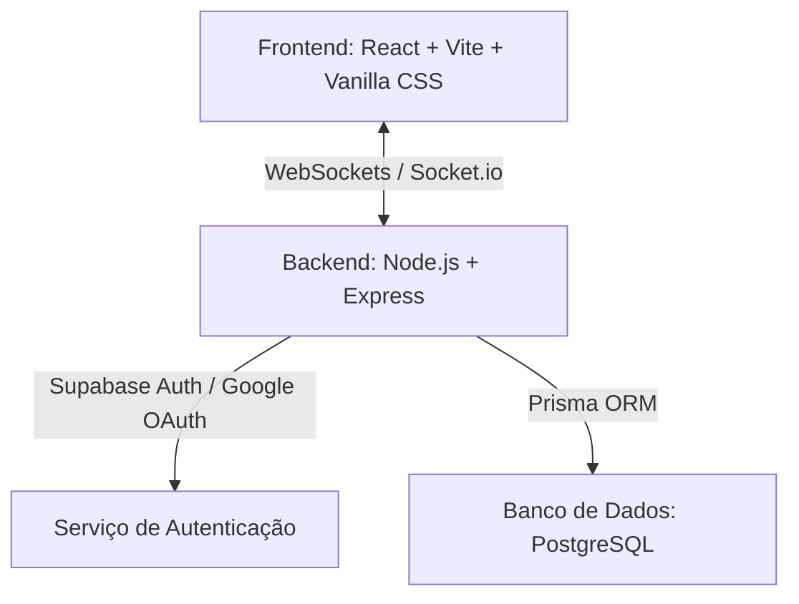
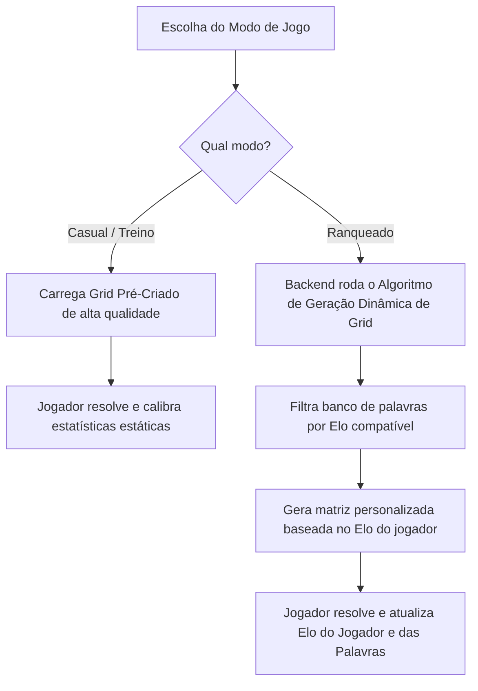

# Sistema de Cruzadas Diretas Ranqueado (Modelagem e Arquitetura)

Este documento apresenta a modelagem detalhada para um sistema de **Cruzadas Diretas** onde tanto os jogadores quanto as palavras possuem um **ranking de habilidade/dificuldade dinâmico**, com suporte a **sessões em grupo (multiplayer)**, **autenticação segura** e um **sistema híbrido de geração de grids**.

---

## 1. Stack Tecnológica Recomendada

Para atender aos requisitos de **sessões em grupo em tempo real**, **autenticação com Google** e **geração/validação segura de tabuleiros**, propomos a seguinte stack:



### Detalhes da Stack:
1. **Frontend:** **React (Vite)** + **Vanilla CSS (Moderno/Premium)**.
   - Excelente para gerenciar o estado altamente interativo do grid de cruzadas.
   - **Socket.io-client** para a comunicação em grupo e status em tempo real.
2. **Backend:** **Node.js (TypeScript + Express + Socket.io)**.
   - Perfeito para manter conexões persistentes (WebSockets) e rodar o algoritmo de geração de matrizes de cruzadas em tempo real.
   - Responsável por validar as respostas do grid de forma segura (sem enviar as respostas em texto limpo para o cliente).
3. **Autenticação:** **Supabase Auth** (ou Firebase Auth).
   - Resolve o login tradicional (email/senha) e a integração com **Google OAuth** de forma simples e segura.
4. **Banco de Dados:** **PostgreSQL** (hospedado no Supabase).
   - Ótimo para lidar com os relacionamentos entre usuários, tabelas de Elo, histórico de soluções e banco de dados de palavras/dicas.

---

## 2. Abordagem Híbrida de Tabuleiros (Casual vs. Ranqueado)

Conforme alinhado, adotaremos uma estratégia híbrida inteligente para combinar o melhor dos dois mundos: tabuleiros polidos e sob medida para diversão, e geração dinâmica personalizada para manter o dinamismo competitivo do Elo.



### A. Modo Casual (Tabuleiros Pré-Criados)
- **O que é:** Uma biblioteca de tabuleiros curados manualmente (com simetria clássica e temas divertidos).
- **Vantagem:** Design visual impecável, dicas altamente criativas e contextualizadas.
- **Funcionamento:** O jogador escolhe o tabuleiro por categoria (ex: "História", "Tecnologia", "Geral") ou dificuldade nominal (Fácil, Médio, Difícil).

### B. Modo Ranqueado (Geração Dinâmica baseada em Elo)
- **O que é:** Um grid gerado sob demanda pelo backend no momento em que o jogador inicia uma partida ranqueada.
- **Como o Algoritmo de Geração Dinâmica funciona:**
  1. **Filtragem por Elo:** O backend obtém o Elo atual do jogador ($R_P$) e busca no banco de dados palavras que estejam no intervalo de dificuldade ideal ($R_P \pm 150$).
  2. **Posicionamento da Palavra Âncora:** Posiciona a primeira palavra de maior Elo no centro do grid.
  3. **Cruzamento Iterativo:** Tenta cruzar outras palavras compatíveis (respeitando as regras de que letras adjacentes precisam formar palavras válidas no idioma).
  4. **Inserção de Caixas de Dica (Cruzadas Diretas):** Para cada palavra inserida, o algoritmo reserva uma célula adjacente (`0`) contendo a dica correspondente e uma seta apontando na direção do preenchimento.
  5. **Finalização do Grid:** O backend valida a completude do grid e o traduz para o **Protocolo de Matriz** seguro antes de enviá-lo ao frontend.

---

## 3. Protocolo do Grid: Matriz e Segurança (Anti-Cheat)

A representação em matriz garante que o frontend não saiba as respostas de antemão, prevenindo qualquer tipo de trapaça via inspeção de código ou rede.

### O que o Backend envia para o Frontend (Apenas Estrutura e Dicas):
1. **Matriz de Células (`grid`):** Uma matriz bidimensional (ex: $10 \times 10$) onde:
   - `0` representa uma célula bloqueada (contendo a dica e a seta).
   - `1` representa uma célula jogável (onde o usuário digita uma letra).
2. **Metadados das Dicas (`clues`):** Uma lista descrevendo a localização das dicas e para onde apontam, **sem revelar a resposta final**:
   ```json
   {
     "gridSize": { "rows": 10, "cols": 10 },
     "matrix": [
       [0, 0, 1, 1, 1],
       [1, 0, 1, 0, 0],
       [1, 1, 1, 1, 1]
     ],
     "clues": [
       {
         "id": "c1",
         "clueText": "Capital do Brasil",
         "direction": "horizontal",
         "arrowDirection": "right",
         "clueRow": 0,    // A célula '0' onde o texto da dica é renderizado
         "clueCol": 1,
         "startRow": 0,   // A primeira célula '1' onde a palavra começa
         "startCol": 2,
         "length": 8
       }
     ]
   }
   ```

---

## 4. Sessões em Grupo (Multiplayer Co-op)

Para o protótipo inicial do jogo em grupo, focaremos no **Modo Cooperativo (Estilo Figma)**, que permite aos amigos resolverem o mesmo grid dinamicamente:
- **Salas em Tempo Real:** Usuários criam salas com IDs únicos e compartilham o link.
- **Cursores Remotos:** Cada jogador vê os cursores e o foco das células de seus amigos em cores distintas (com o nome do jogador flutuando sobre a célula).
- **Resolução Compartilhada:** Letras digitadas por qualquer jogador são sincronizadas instantaneamente via WebSockets para toda a sala.

---

## Próximos Passos & Aprovação

O plano está consolidado com a estratégia híbrida de tabuleiros (Casual pré-criado vs. Ranqueado gerado dinamicamente). 

> [!TIP]
> Com a sua aprovação deste plano de modelagem, iniciaremos a criação do projeto criando a pasta do **Backend (Node.js)** e a do **Frontend (React)** para implementarmos os primeiros mocks visuais interativos e o algoritmo gerador de cruzadas.

Você aprova este plano para começarmos a escrever os códigos?
