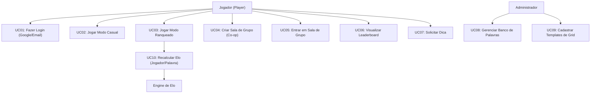
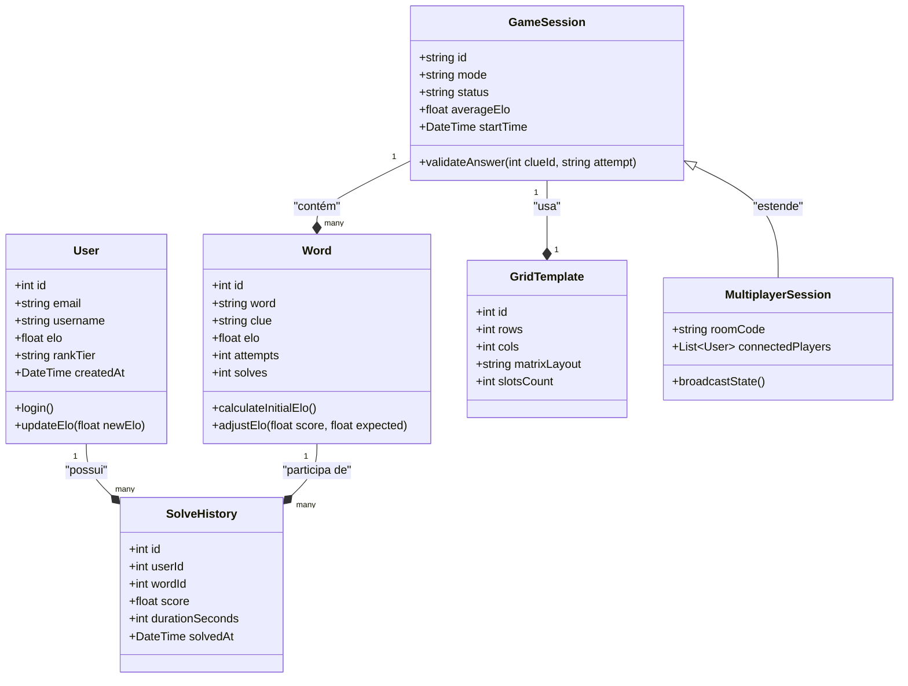
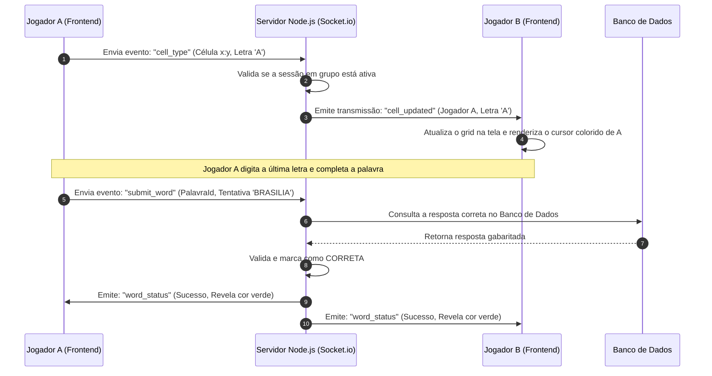
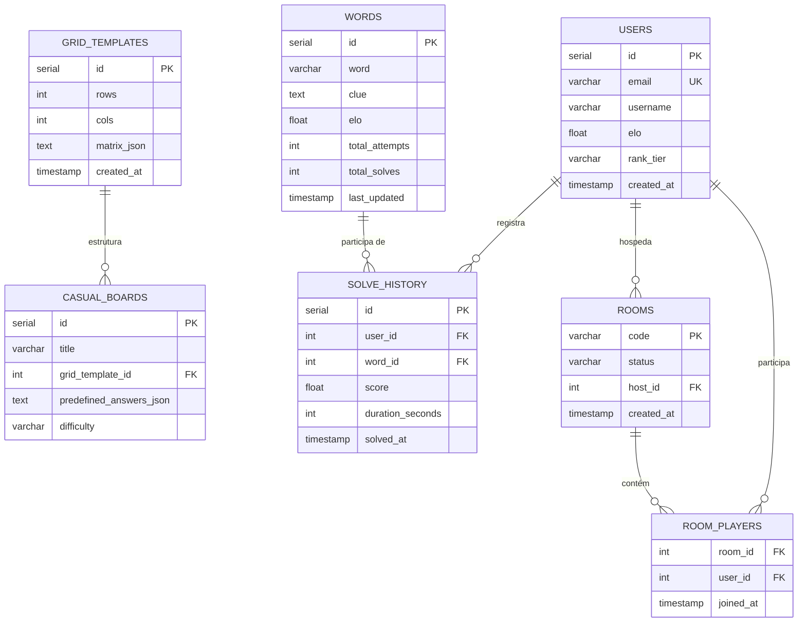

# Documentação de Arquitetura do Sistema - Cruzadas Diretas Ranqueadas

Esta documentação detalha a engenharia, modelagem de dados e arquitetura de fluxos para o **Sistema de Cruzadas Diretas Ranqueadas**. Ela foi estruturada como uma referência técnica antes do início do desenvolvimento.

---

## 1. Atores do Sistema

Identificamos os seguintes atores que interagem com o sistema:

| Ator | Tipo | Descrição |
| :--- | :--- | :--- |
| **Jogador (Player)** | Humano / Externo | Usuário final que realiza login, joga nos modos casual e ranqueado, e cria ou participa de salas cooperativas. |
| **Administrador (Admin)** | Humano / Externo | Usuário com privilégios para cadastrar novas palavras, gerenciar templates de grids e moderar o banco de dados. |
| **Engine de Matchmaking/Elo** | Sistema / Interno | Subsistema automatizado responsável por parear jogadores em salas e calcular os reajustes de Elo após os jogos. |
| **Serviço de Autenticação (Google/Supabase)** | Sistema / Externo | Provedor externo responsável por validar as credenciais de login e fornecer o token seguro (JWT). |

---

## 2. Diagrama de Casos de Uso (UML Use Case)

Este diagrama demonstra os principais casos de uso do sistema divididos por atores.

---

## 3. Diagrama de Classes UML (Modelagem de Domínio)

Este diagrama representa a estrutura de classes do sistema e seus relacionamentos no backend.

---

## 4. Diagrama de Sequência (UML Sequence)

Este diagrama de sequência demonstra a interação em tempo real de uma **sessão cooperativa em grupo**, onde o Jogador A digita uma letra em uma célula e ela é replicada para o Jogador B.

---

## 5. Diagrama de Entidade-Relacionamento (DER)

Abaixo está o modelo relacional de banco de dados (PostgreSQL) otimizado para lidar com autenticação, histórico de jogos e o dicionário de palavras calibradas por Elo.

---

## 6. Validação de Regras de Negócio e Casos de Borda

### A. Validação de Elo (Prevenção de Inflação)
* **K-Factor Variável:** Jogadores novos iniciam com $K = 40$ para rápida calibração. Jogadores estáveis (com mais de 50 partidas) reduzem para $K = 20$. Palavras mantêm $K = 16$ fixo para evitar flutuações agressivas causadas por um único usuário fora da média.
* **Glicko-2 (Alternativa Futura):** Se houver muita inatividade de certos jogadores, o sistema pode adotar o fator de incerteza do Glicko-2 para evitar perdas/ganhos injustos.

### B. Tratamento de Desconexões no Multiplayer
* Se um jogador cair da sala no meio da resolução cooperativa, o progresso do grid não é perdido (permanece em cache no servidor Node.js/Redis ou banco de dados temporário).
* Ao reconectar usando o mesmo token de autenticação, o servidor envia o estado consolidado da sala atualizado.
