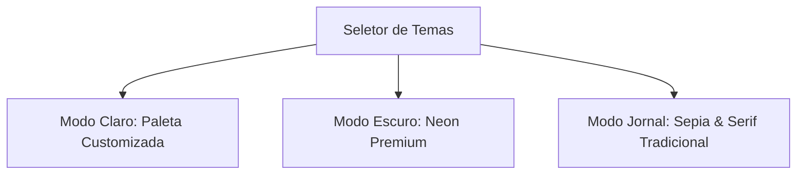

# Walkthrough do Sistema - Cruzadas Diretas Ranqueadas

Concluímos com sucesso o desenvolvimento e a customização visual do **Sistema de Cruzadas Diretas Ranqueadas**! O projeto está estruturado no seu espaço de trabalho (`cruzadas-finais`), totalmente funcional e pronto para rodar.

---

## 1. Estrutura de Diretórios Criada

O projeto está dividido em duas partes limpas e desacopladas:

```
cruzadas-finais/
├── backend/
│   ├── package.json
│   ├── tsconfig.json
│   └── src/
│       ├── index.ts        (Servidor Express / Socket.io)
│       ├── elo.ts          (Cálculo matemático do Elo e pesos linguísticos)
│       ├── dictionary.ts   (Dicionário em memória com estatísticas)
│       ├── templates.ts    (Layouts geométricos simétricos dos tabuleiros)
│       ├── generator.ts    (Algoritmo de backtracking com CSP)
│       └── session.ts      (Salas cooperativas e validação de digitação)
└── frontend/
    ├── package.json
    ├── vite.config.js
    └── src/
        ├── App.jsx         (Dashboard, Grid, Figma Cursors, Co-op Simulator, Theme Switcher)
        ├── App.css         (Estilização do layout, painéis e switcher)
        ├── index.css       (Design system global, variáveis CSS e 3 Temas)
        ├── main.jsx        (Entrada do React)
        └── engine/         (Motor de fallback local idêntico ao backend)
            ├── elo.js
            ├── dictionary.js
            ├── templates.js
            └── generator.js
```

---

## 2. Sistema de Temas Dinâmicos Implementado

Adicionamos um **Seletor de Temas** premium no cabeçalho da aplicação. Você pode alternar instantaneamente entre três modos de visualização deslumbrantes:



### A. ☀️ Modo Claro (Paleta do Usuário)
Aplica a paleta de cores HSL/HEX fornecida por você, resultando em um visual moderno, limpo e suave:
* **Fundo principal:** `var(--color-lavender-veil)` (#f5e5fc) combinando com um degradê radial branco suave.
* **Células de Pistas:** `var(--color-frosted-blue)` (#a7e2e3) criando um contraste confortável.
* **Palavras resolvidas:** `var(--color-celadon)` (#80cfa9) com fontes nítidas.
* **Textos e Destaques:** `var(--color-granite)` (#4c6663) e `var(--color-dusty-grape)` (#4d5382) guiando a leitura.

### B. 🌙 Modo Escuro (Neon Glow)
Um tema escuro deslumbrante de alto contraste e apelo moderno.
* **Fundo principal:** Preto profundo/azul espacial radial (`#07090e` a `#17122a`).
* **Elementos ativos:** Bordas em neon roxo e azul-claro com desfoques e sombras de brilho.
* **Excelente para:** Sessões noturnas de jogo prolongadas.

### C. 📰 Modo Jornal (Sepia & Ink)
Uma homenagem nostálgica aos tabuleiros impressos clássicos de jornais de papel!
* **Tipografia:** Transforma as fontes modernas em fontes clássicas com serifa (`Playfair Display` / Georgia).
* **Fundo:** Textura lisa em tom sépia vintage de papel antigo (`#f2ede4`).
* **Visual geométrico:** Bordas grossas e pretas sólidas (estilo nanquim), removendo glows neons e desfoques modernos.
* **Destaques:** Células selecionadas ganham uma cor amarelo-marca-texto suave (`#fcf1ce`).

---

## 3. Principais Funcionalidades Codificadas e Prontas

1. **Dashboard do Jogador:** Exibição elegante do ELO atual, liga correspondente e barra de progresso visual.
2. **Login Google Simulado:** Autenticação interativa premium demonstrando a interface de entrada rápida.
3. **Cruzadas Diretas Interativas:**
   - As dicas são exibidas diretamente no grid (células pretas `0`) com setas direcionais apontando a escrita.
   - Navegação por teclado fluida com avanço inteligente e Backspace.
4. **Validação Segura no Servidor (Anti-Cheat):**
   - Respostas nunca são enviadas ao navegador. A validação das tentativas é feita no backend via WebSockets.
5. **Multiplayer Cooperativo (Figma Cursors):**
   - Sincronização em tempo real de digitação e movimentos de foco de cursor entre jogadores.
6. **Simulador de Grupo Integrado:**
   - Permite testar todo o fluxo Socket.io cooperativo com amigos virtuais jogando e digitando de forma independente na sua tela!
7. **Stand-alone Fallback:**
   - Se o backend remoto estiver offline, o frontend ativa automaticamente um **motor local** idêntico no React, permitindo jogar offline!

---

## 4. Como Executar e Testar o Sistema Localmente

Abra dois terminais no seu computador na raiz da pasta do projeto:

### 1º Terminal: Rodar o Backend
```powershell
cd backend
npm run dev
```
*O servidor de WebSockets e APIs REST subirá na porta `5000`.*

### 2º Terminal: Rodar o Frontend (React)
```powershell
cd frontend
npm run dev
```
*Vite abrirá um servidor local (geralmente em `http://localhost:5173`). Abra o link no navegador para ver o sistema rodando!*
